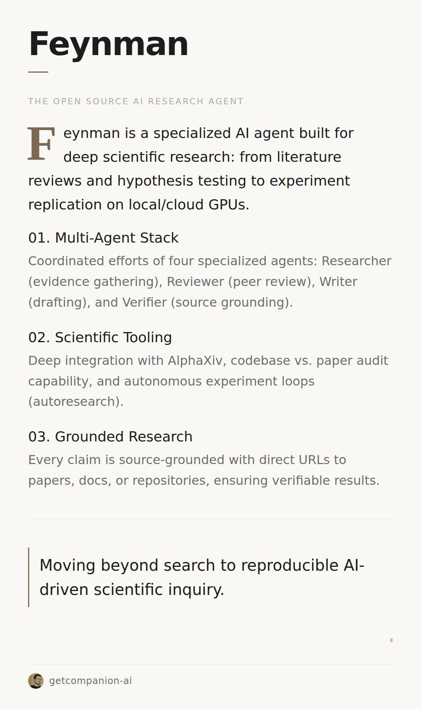

# openclaw-card

GitHub repository for an OpenClaw skill that generates editorial cards using a fixed Li Jigang inspired template.

## Contents

- `skills/openclaw-card/SKILL.md` - primary English skill
- `skills/openclaw-card-ru/SKILL.md` - Russian-language variant
- `skills/openclaw-card/references/taste.md` - taste and layout constraints
- `skills/openclaw-card/assets/card-template.html` - base HTML card template
- `skills/openclaw-card/scripts/capture.js` - deterministic PNG renderer via Playwright
- `agents/openai.yaml` - package UI metadata

## Principles

- No freeform redesigning
- Fixed IT/Engineering palette: `#F5F7FA` and `#3D5A80`
- Fixed template semantics: `dropcap`, `item/label`, `highlight`
- Fixed render settings: `1080x800`, `fullPage`
- Expected OpenClaw response format: `MEDIA:${HOME}/.openclaw/workspace/media/{name}.png`

## Structure

```text
.
├── agents/
│   └── openai.yaml
├── package.json
└── skills/
    ├── openclaw-card/
    │   ├── SKILL.md
    │   ├── assets/
    │   ├── references/
    │   └── scripts/
    └── openclaw-card-ru/
        └── SKILL.md
```

## Local Rendering

Requires `node` and `playwright`.

```bash
npm install
node skills/openclaw-card/scripts/capture.js /absolute/path/to/card.html /absolute/path/to/card.png
```

## Example Card

Example output card:



## License

Not specified yet.

## Acknowledgements

This repository is directly inspired by Li Jigang's skill work and card discipline.

References:

- `lijigang/ljg-skills`: https://github.com/lijigang/ljg-skills/
- `ljg-card` example: https://github.com/lijigang/ljg-skills/blob/master/skills/ljg-card/SKILL.md
